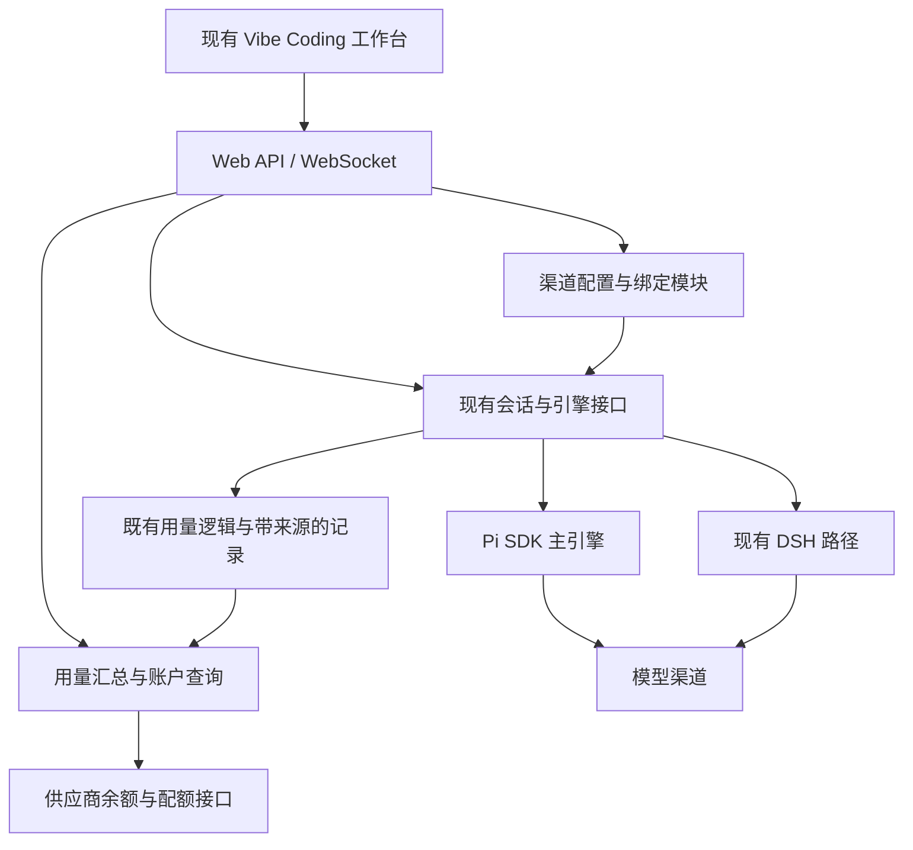

# PI-dev 多渠道开发基准（DEV-CON）

<!-- 🍞 AI Breadcrumb — @COUPLED README.md, STRUCTURE.md, ../CONTEXT.md
     @CONTRACT 本文件是当前功能范围、架构、开发顺序与验收的唯一基准。 -->

- 版本：**v1.3，文档整理后的统一基准**（P0/P1 实施进度见第8节，结论见[P0 技术验证](P0-VERIFICATION.md)）。
- 产品方向：以 Pi 为核心的个人远程开发工作台；保留现有 Web 应用的 Pi/DSH 引擎边界。
- 当前状态：**开发已恢复，按第8节顺序推进**。P0 七项技术验证已收口（见[P0-VERIFICATION.md](P0-VERIFICATION.md)）；P1 渠道配置与对话切换已实现服务端与界面路径，待浏览器回归与真实验收；P2 用量口径与渠道归属已实现，P3 账户查询已实现适配器与本地替身验证，均未用真实供应商账号验收。
- 首个交付目标：在 Vibe Coding 界面内完成渠道配置、热切换、用量/费用展示及支持的账户查询。
- 本文件吸收原架构方案及 v1.2 开发方案；旧多 Agent 方案、M0–M5 排期及工期估算不再有效。

## 1. 使用规则与文档分工

后续需求拆解、技术设计、编码和功能验收均从本文件开始。已确认范围见第2节，实施约束见第3–7节，阶段和验收见第8–10节。P0技术问题不能当作已实现能力，也不能借验证重新扩大产品范围。

| 文档 | 作用 | 是否定义本期需求 |
| --- | --- | --- |
| 本文件 | 功能范围、架构、开发顺序、未决技术项和验收标准 | **唯一基准** |
| [P0 技术验证结论](P0-VERIFICATION.md) | 第9节七项的实现结论、证据与未验证项 | 否，只记录结论与证据 |
| [CONTEXT.md](../CONTEXT.md) | 领域词汇定义 | 否，不放排期和架构决策 |
| [STRUCTURE.md](STRUCTURE.md) | 目录、源码/数据、依赖及工程入口边界 | 否，实施时遵循其工程约束 |
| [P0 技术验证结论](P0-VERIFICATION.md) §7 | 入口安全与实际加固记录 | 否，结论与证据 |
| [OPERATIONS.md](OPERATIONS.md)、[PM2-PRODUCTION.md](PM2-PRODUCTION.md)、[PM2-SHADOW.md](PM2-SHADOW.md) | 安装、正式运行和候选发布规则 | 否，不能据此自动部署 |
| [历史材料索引](history/dev-con/README.md) | 前期评估、架构讨论、原型与当时验证 | 否，不得据此恢复旧范围 |
| 原 SYSTEM-ARCHITECTURE-REVIEW / ASSESSMENT / IMPLEMENTATION 路径 | 旧链接兼容入口 | 否，仅跳转到本文件或归档 |

用户后续明确指示优先；范围变更先更新本文件并记录，再同步摘要与词汇。不得新增一份同时定义相同需求的“最终计划”。上游 vendor 文档用于了解实现，不覆盖本项目产品范围。若工程约束与功能要求冲突，应明确记录具体冲突，不能默默选用归档方案。

## 2. 产品范围

### 已确定的要求

- Pi 是主要编码 Agent；保留当前 pi-web-ui 的 Pi/DSH 架构及能力差异，不重写 Agent 核心。
- 日常渠道功能优先整合到现有编码界面和后端模块；DEV-CON是管理功能名称，独立控制台不是前置条件。
- 配置多个渠道，在对话中方便选择渠道/模型，明确显示实际使用和待生效状态。
- 展示可追溯的 Token 消耗、估算费用；按供应商支持情况提供账户余额、key配额与查询状态。
- CC Switch只作渠道配置、选择、切换及管理交互的功能参考。

### 明确不做

Claude Code、Codex CLI、Gemini等外部原生Agent的接入与管理；happy集成；跨工具配置/Skills同步；外部原生会话互通；CC Switch整套移植或运行依赖；自动故障切换；模型网关。

通过Pi使用Claude、GPT/Codex系列模型仍属于渠道访问能力，不等于引入其原生Agent。DSH保留既有支持范围，不要求与Pi新增功能完全对等，也不把“存在代码”标成已启用或已验收。

首个交付闭环为P1–P3。跨渠道/项目/时间用量历史按用户指示作为 P4 首个切片实施（见第8节）；更多监控、资源展示与独立运维仍属候选，不自动纳入。

## 3. 目标架构与技术栈

- 自研业务统一TypeScript/Node ESM、React/Vite，复用现有Express/ws及受支持工具链；稳定mjs工程脚本保留。
- 渠道模块负责配置、绑定和生效，不代理模型流量；账户查询、汇总故障不阻塞编码请求。
- 保留Pi会话格式、工具、扩展及上下文管理；普通切换不以新建对话或重启工作台实现。
- 保留root/vendor锁文件、release/私有数据/workspace边界。业务逻辑落在实际所属应用内，不经包外路径引用根scripts业务实现。
- 共享模块、数据库、独立进程仅由实际需求推动；不先创建通用多Agent框架、分布式任务平台或第二套模型/凭据后台。
- 8791保留为后续运维预留，与渠道功能无关；渠道管理整合进现有 Web 模块，不再有独立控制台。

### 现有实现的复用位置

以下路径均相对 `vendor/pi-web-ui/`；它们表示现有能力及重构起点，不代表本期需求已完成。

| 责任 | 现有位置 | 本期要求 |
| --- | --- | --- |
| 渠道配置/多密钥 | `server/model-admin.ts` | 分开纯读取、持久写入和运行时应用；无损保存、错误传播 |
| 模型与会话 | `server/agent-service.ts::setModel`、SDK | 建立对话绑定与明确生效边界，解决授权作用域 |
| 项目及界面偏好 | `server/client-state.ts` | 区分对话、项目、实例及界面设置，禁止隐式跨作用域写入 |
| 消息契约 | `server/protocol.ts` | 继续作为Web类型来源，新增输入配同源运行时校验 |
| 用量与费用 | SDK统计、`lib/usage/`、服务端统计推送 | 复用唯一业务实现，补归属、去重和必要持久化 |
| 编码界面 | `web/src/components/ModelThinking.tsx`、`FooterBar.tsx` | 复用选择器/状态栏，新增职责用独立模块承载 |
| 账户信息 | 尚无统一实现 | 有证据的供应商查询适配，限频/缓存/超时与状态 |

## 4. 配置对象、所有权与安全

最小对象为渠道档案、协议端点、凭据引用、模型记录、账户引用、对话绑定，含义见词汇表。同供应商可以有多个协议端点；同账户可以有多把key；展示别名与实际模型ID分别记录。

绑定至少可追踪conversationId、channelId、endpointId、credentialRef、modelId和bindingRevision，并关联所用configRevision。前者标识对话选择的版本，后者标识渠道配置的版本；具体schema由P0固定。历史只记录引用与版本，不记录密钥。

| 数据 | 所有权与处理要求 |
| --- | --- |
| models.json | SDK模型声明，收拢已有写入口，保留未知字段 |
| auth.json | SDK授权；使用兼容的写入契约，保留认证类型 |
| provider-keys.json | Web命名多密钥信息，不能独立宣称最终生效值 |
| models-store.json | SDK模型目录缓存，不作为人工渠道主库 |
| 新增渠道元数据 | 仅补显示名、账户关联、绑定版本等缺失概念；不复制完整可写模型/密钥库 |
| 项目/实例默认 | 显式维护的默认选择，与当前对话绑定分开 |

必须区分：编辑渠道档案、切换当前对话、设置项目默认、修改实例全局默认。项目默认供新对话继承；修改默认不悄悄重绑已运行对话。界面应能解释当前绑定的来源及是否覆盖默认。

当前SDK凭据优先级为runtime override → auth.json →环境变量→models fallback。现有项目key恢复会调用全局激活，多个对话还会共享ModelRuntime；P0必须验证隔离策略，不能把setRuntimeApiKey直接当成对话私有设置。

配置变更采用校验/预览 → revision复核 → 应用 → 验证和回执。已知外部修改不能被静默覆盖；未知字段、恢复前当前版本及认证类型需保留。单文件rename不代表多个文件及内存状态的原子事务，部分失败必须可辨识并有恢复方案。

查询不能悄悄修改配置；普通渠道选择使用一个组合命令处理渠道、key及模型，不能靠两个独立异步消息推定成功。读写接口均需鉴权，API/浏览器/日志不回传密钥正文或掩码片段。P0复核既有模型密钥回传和登录会话风险，P1交付前修复与本期入口相关的问题；不据此扩展成整套认证平台重写。

模型连通性和账户查询均需有界超时、响应体上限、目标/重定向策略及限频。目录可读不代表推理可用，HTTP状态码不能单独证明余额或模型状态；常规测试不得使用操作人的真实凭据。

## 5. 热切换与会话语义

目标：用户在编码界面切换已配置渠道，保留Pi对话、上下文、工作区及工具状态，正常路径不重启Web/PM2。

| 场景 | 必须满足的行为 |
| --- | --- |
| 空闲对话 | 校验模型/协议/授权，准备目标绑定，成功后确认生效；失败保留原绑定 |
| 正在生成 | 已发请求按原绑定完成；新选择显示待生效，在验证过的SDK安全边界应用 |
| 正在执行工具 | 不自动中止工具，不重放已执行步骤；需要等本轮结束时明确显示 |
| 后台对话/子代理/复核 | 各自绑定不受前台切换隐式影响 |
| 切换失败 | 不出现无提示的“UI已换、实际未换”；明确有效绑定和失败阶段 |
| 多端操作 | 服务端排序并返回版本；旧回执不得覆盖新状态 |
| DSH | 保留实际能力；需要重建运行时的操作不能承诺Pi式热切换 |

精确切换边界由P0验证。若SDK不支持当前run内更改，推迟到该轮完成并展示；不提前承诺任意时刻即时切换。常用兼容选择尽量一步完成，删除凭据、恢复配置、改变全局默认等操作才额外展示具体影响。

Pi继续拥有会话JSONL树、压缩、分支及工具调用关联。沿用现有多端接力，验证同一会话的唯一写入者与绑定一致性；clientId是客户端标识，不当成操作者或长期会话身份。不新建跨引擎会话格式。

PTY、后台进程和对话具有不同生命周期；浏览器断线不等于取消运行，保存历史不等于可无损恢复执行中的工具。恢复不得自动重放可能已产生副作用的步骤。

## 6. 编码界面与使用流程

| 入口 | 内容 |
| --- | --- |
| 现有渠道/模型选择器 | 常用渠道、可用模型、命名凭据、当前有效与待生效选择 |
| 状态栏 | 当前渠道/模型、会话Token及估算费用；支持时显示余额摘要和查询时间 |
| 详情面板 | 请求/本轮/会话用量、渠道分布、账户余额、key配额、异常和手动刷新 |
| 设置页 | 渠道新增/编辑/禁用、模型映射、凭据维护、价格来源、校验与恢复 |

流程为：配置渠道一次 → 在当前编码界面选择渠道/模型 → 查看生效回执 → 随时展开消耗与账户详情。日常切换不需离开会话或进入独立管理台。详情不堆满输入区，桌面与移动端均应可用。

## 7. 用量、费用、余额与配额

请求发出时固定渠道/凭据/模型与绑定版本；晚到结果按原请求归属记录。切换、改名或删除渠道不能把旧用量归到新渠道，旧历史缺少归属时标为未归属，不能用今天的配置推断过去。

| 指标 | 来源与展示要求 |
| --- | --- |
| Token | SDK/模型响应的输入、输出、缓存读写，区分请求、运行和会话 |
| 估算费用 | 相应渠道/模型当时价格规则，标明估算、币种、来源与版本；未知价格为空 |
| 供应商实际扣费 | 有可靠接口时另列，不与本地估算合并成同一指标 |
| 账户余额 | 供应商账户接口，带账户、单位/币种、查询时间与状态；不能从Token倒推 |
| key配额 | 特定key的可用量或限制，与账户余额分别展示 |
| 调用/速率限制 | 供应商报告的窗口或限制，不当成资金余额 |

记录包含稳定请求/事件标识、对话/运行、渠道/账户引用、模型、绑定/配置版本、用量、时间和计价依据。流式累计usage与最终usage归并去重；重试按实际尝试分别记录。子代理、复核、压缩摘要及探测分别标注来源，保留模型报告缺失时的未知状态。

P2先完成请求/运行/会话口径与归属，为项目/时间汇总保留必要维度。跨日历史分析和长期保留策略在P4候选中评估，不能为首期展示提前复制整套计费逻辑。

余额按实际使用且接口可核实的供应商接入。模型API key不一定能查账；仅使用用户为该用途明确配置的授权。能力状态包括不支持、查询中、成功、失败、过期；失败保留上次结果及旧时间，不显示为0。不同账户/币种和账户余额/key配额不能无依据相加。

## 8. 开发顺序与状态

下列为功能依赖顺序，不是固定工期或完成声明。旧M0原型不计入本期交付；恢复开发后首先完成P0，再按结果安排任务。

| 阶段 | 交付目标 | 当前状态 |
| --- | --- | --- |
| P0 技术验证与设计收口 | 授权隔离、热切换边界、组合命令/版本、用量事件口径、界面流程 | **已收口**，结论与证据见 [P0-VERIFICATION.md](P0-VERIFICATION.md) |
| P1 渠道配置与切换 | 渠道设置、命名凭据、模型映射、对话切换、生效回执和恢复 | 服务端与界面已实现（`server/dev-con/`、`channel_*` 协议、模型选择器/渠道设置）；双对话双密钥、双客户端与 Chromium（桌面+移动视口）用例均通过；真机人工验收与真实供应商账号未做 |
| P2 编码界面用量 | 当前渠道、请求/运行/会话Token和费用、可靠渠道归属 | 已实现：终态去重、缓存/费用字段、来源/渠道/模型归组、**逐请求记录（稳定 id + 时间 + 计价依据，未知价格为空）**、历史缺失归属诚实提示；界面有 Chromium 断言（`npm run test:channels:browser`） |
| P3 余额与配额 | 实际供应商查询、缓存/失败/过期状态和界面整合 | 适配器层 + OpenAI 兼容网关/OpenRouter 实现完成，仅对本地替身验证（界面已断言 ok/unsupported/stale 三态）；未接真实账号 |
| 入口安全加固（A10 增量） | 既有认证面的廉价修复，不扩成认证平台重写 | 已完成：认证 POST 固定窗口限流、恢复码哈希落盘（兼容旧明文并迁移）、健康端点详情按鉴权/直连收敛、`?token=` 开关回归用例；仍未做 passkey CSRF 令牌与 `revoke` 鉴权（记录在 P0 文档） |
| P4 后续候选 | 跨渠道/项目/时间历史、更多监控、资源展示与必要运维 | 已按用户指示完成两项：①跨渠道/项目/模型/来源/按天的用量历史；②系统资源展示（CPU/内存/磁盘/应用与 unit 占用，只读、带来源标签与估算说明）。其余监控与运维仍按需求另排 |

## 9. P0必须给出结论的技术项

这些是实现问题，不是仍需重复确认的产品方向。**七项的结论、证据与未验证项统一记录在 [P0 技术验证结论](P0-VERIFICATION.md)**，本节只保留问题与固定边界，不另写竞争性计划。

| 项目 | 要回答的问题与证据 | 固定的产品边界 |
| --- | --- | --- |
| 凭据隔离 | 如何在复用模型目录时隔离并行对话授权？两对话/不同key夹具验证 | 不隐式改全局key或其他对话 |
| 切换时点 | SDK允许请求间还是run结束后切换？覆盖流式和工具执行 | 保留当前请求/工具，清晰显示待生效 |
| 命令与状态 | 组合绑定、configRevision/bindingRevision、失败回执如何定义？ | 服务端确认实际状态，多端无旧回执覆盖 |
| 用量身份 | 哪些事件是累计/增量/终结？如何标识重试、摘要和子代理？ | 不重复计数、不串渠道、未知不伪造 |
| 存储与恢复 | 最小元数据放哪里，哪些SDK写入契约要遵循？ | 无第二套独立模型/密钥事实源，可检测冲突和恢复 |
| 账户查询 | 首批实际供应商、接口、授权类型、单位是什么？ | 不支持时明确展示；不猜测余额 |
| 入口安全 | 既有密钥回传/登录会话问题是否影响新增入口，必要修复范围是什么？ | 鉴权及凭据不外泄，不扩大成通用认证平台 |

## 10. 验收清单

| 编号 | 对应阶段 | 必须通过的场景 |
| --- | --- | --- |
| A01 | P0/P1 | 两个并行Pi对话使用不同渠道/key，切换其中一个不影响另一个及后台任务 |
| A02 | P1 | models/auth/多密钥配置无损往返；外部修改冲突可见，部分失败可恢复 |
| A03 | P1 | 空闲、生成中、工具执行中切换符合第5节，正常切换不重启工作台 |
| A04 | P1 | 切换失败保留可解释的原绑定；组合命令不造成key/model错配 |
| A05 | P1/P2 | 多端看到相同有效绑定，旧回执/晚到用量不覆盖或误归到新渠道 |
| A06 | P2 | 流式累计与最终事件去重，重试/缓存/子代理/复核/压缩来源正确 |
| A07 | P2 | 费用具有计价依据；旧历史缺失归属诚实展示，改配置不篡改历史 |
| A08 | P3 | 余额、key配额、币种与账户范围正确，不支持/失败/过期状态明确 |
| A09 | P3 | 慢响应、超时、畸形结果及查询故障不阻塞编码，目标策略和限频有效 |
| A10 | P1–P3 | API/日志无密钥回传；必要认证、权限和错误处理通过回归 |
| A11 | P1–P3 | 桌面/移动端完成配置、选择、待生效反馈、详情查看；原有Pi/DSH边界不回归 |

端到端示例：配置A/B；会话一用A、会话二用B。会话一生成中选择B，当前请求仍归A，界面显示待生效；在验证过的边界切换后新请求归B，会话二不受影响。余额按账户展示，B不可用时明确失败而不静默切换或重放工具。手机看到同一服务端确认状态。

常规验证用临时配置、合成凭据、本地模型/账户接口替身；真实模型或余额查询仅在明确目标的后续验收中进行。按变更范围运行根/应用单元、类型、协议、浏览器和发布检查，报告实际结果，不沿用旧原型测试数字宣称完成。

## 11. 旧原型、历史材料与后续维护

`dev-con/` 只读原型及其专用测试已按用户决定**从仓库移除**（原型的独立认证、页面与外部 Agent 占位均不在本期范围内）；原型的调查记录保留在 [归档索引](history/dev-con/README.md)，供复查，不再作为实现起点，也不反向决定需求。原型的跨标签页注销修复等历史结论仅作背景，不代表当前实现状态。渠道功能唯一实现位置是现有 Web 应用（`vendor/pi-web-ui/server/dev-con/` 模块 + 现有界面），不再保留第二套控制台。

与本期直接相关的配置、授权、查询和统计风险已纳入P0/P1。归档中上游来源记录、CI审计、构建保护、紧急停止等其他工程问题仅是调查线索，需独立核实与排期，不能复活旧综合管理台范围。Skills/MCP/插件沿用当前宿主体系，跨工具同步不恢复。

历史材料见 [归档索引](history/dev-con/README.md)。原三个文档路径只保留跳转，以兼容已有代码注释和链接。工程/运维文档继续限定各自操作范围；历史迁移中的授权记录不作为未来部署授权。

### 本版整理记录

v1.3 整理：合并产品与架构要求，统一配置/切换/统计口径、P0–P3顺序及验收编号；归档旧评估、架构讨论和原型记录；更新根README、目录说明与文档索引。

v1.3 + P0 实施：按第8节顺序恢复开发。P0 七项结论与证据写入 [P0-VERIFICATION.md](P0-VERIFICATION.md)；P1–P3 服务端与界面实现、验收状态见第8节表格；按用户决定移除 `dev-con/` 只读原型及其专用测试，端口 8791 保留为后续运维预留。新增测试入口：`npm run test:channels:unit`（渠道模型/存储/服务/账户单测）与 `npm run test:channels`（真实服务端双对话双密钥端到端）。
