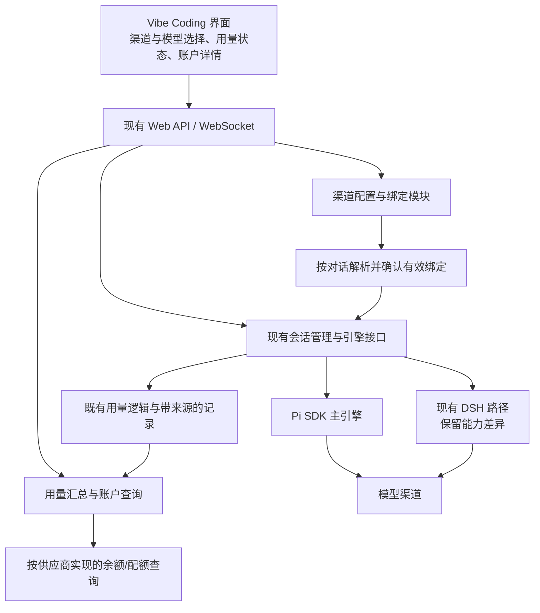

# PI-dev 技术栈与架构整合方案：Pi 核心与多渠道体验（已归档）

> **历史材料，不作为开发依据。** 正文保留当时的判断、建议和验证状态；不得据此恢复旧范围、旧排期或执行部署。当前唯一开发基准为 [DEV-CON-PROPOSAL.md](../../DEV-CON-PROPOSAL.md)。

<!-- 🍞 AI Breadcrumb — @COUPLED docs/DEV-CON-PROPOSAL.md, docs/STRUCTURE.md, CONTEXT.md
     @CONTRACT 路径相对仓库根；本讨论已合并归档，不再独立定义开发要求。 -->

## 1. 已明确的产品方向

PI-dev 的目标是构建以 Pi 为核心、适合个人使用习惯的远程开发 Agent 环境。用户已明确：

1. 采用统一自研技术栈、清晰模块边界和统一配置责任的整合方向。
2. Pi 是主要编码 Agent；保留现有 pi-web-ui 的 Pi/DSH 引擎架构与能力差异。
3. 不接入 Claude Code、Codex CLI 等原生工具，不建设外部 Agent 聚合平台、原生会话互通或跨工具配置同步。
4. CC Switch 是多渠道配置、切换和管理交互的功能参考；不引入其整套应用、后台服务或全部功能。
5. 核心体验在 Vibe Coding 界面内：方便切换渠道/模型，清晰查看实际使用的渠道、Token、费用及渠道支持的账户余额信息。

本轮仅修订文档。`feature/dev-con-foundation` 的代码仍为暂停状态的未提交原型，不删除、不迁移、不部署。此前多 Agent 接入方案、独立控制服务作为前置条件及30–46日估算均不再适用。

使用供应商提供的 Claude、GPT/Codex 系列模型仍属于 Pi 的模型访问能力；排除的是外部原生 Agent 运行时及其配置/会话管理。DSH是当前Web应用已保留的引擎路径，不将其描述为Pi SDK内部接口，也不把现有代码存在视为当前已启用。

## 2. 目标架构与技术栈

建议先采用现有Web应用内的模块化实现，复用TypeScript/Node ESM、React/Vite、Express/ws及当前受支持工具链。保留Pi SDK、会话格式和工具/扩展机制，不为多渠道功能新增通用Agent运行框架。

图中的渠道模块负责配置和生效，不代理模型流量；Pi/DSH继续使用自身模型访问链路。余额查询与用量汇总不阻塞模型请求，查询失败不影响编码。

日常渠道管理作为同一工作台中的设置页/详情面板，快速切换和关键指标常驻编码界面。DEV-CON名称可继续用于管理功能，但独立8791服务不再是渠道功能的前提。未来若需要聊天服务故障时仍可用的运维入口，再单独评估最小独立管理面；这是后续建议，不是本轮部署动作。

root/vendor两套锁文件、release/私有数据/workspace边界继续保留；业务逻辑按所属模块放入vendor应用，运行脚本保留mjs。先复用实际模块，出现第二个真实消费者后再抽共享package。新增数据库也必须由持久化需求推动，不为一个渠道下拉框提前增加服务。

## 3. 已有基础与真实缺口

| 范围 | 已有实现证据 | 需补齐的能力 |
| --- | --- | --- |
| 模型选择 | `server/agent-service.ts::setModel`、`web/src/components/ModelThinking.tsx` | 把渠道、凭据引用和模型作为一个可确认的绑定切换，处理异步竞态 |
| 多密钥 | `server/model-admin.ts::addProviderKey/activateProviderKey/applyActiveKey` | 分开当前对话使用的key与全局默认，避免影响其他对话 |
| 模型配置 | models.json、ModelAdmin保存/刷新入口 | 保留未知字段，冲突检测、备份恢复、错误和生效回执 |
| Token与费用 | SDK会话统计、`lib/usage`、`agent-service.ts`统计推送、`FooterBar.tsx` | 请求级渠道归属、可靠去重、按渠道/项目/时间聚合；保留缓存与计价信息 |
| 项目偏好 | client-state中的projectModels/projectProviderKeys | 统一作用域与覆盖优先级，避免切项目修改全局授权 |
| 多端接力 | 节点落盘广播、空闲时重载 | Pi会话唯一写入者与多端实际绑定一致性，保留原有行为并逐项验证 |
| DSH | Web引擎分发和独立实现 | 保留现有支持范围；不为Pi首期渠道功能强制补齐DSH |
| 余额与配额 | 尚未发现统一查询实现 | 独立供应商查询适配、超时/缓存、能力状态、来源及更新时间 |

本次为源码核查，未访问真实模型、账户或凭据。现有代码和历史测试不能证明热切换与账户统计已经形成完整产品闭环。

## 4. 渠道模型与配置所有权

建议的最小对象：渠道档案、协议端点、凭据引用、模型记录、账户引用、对话绑定。术语见根 [CONTEXT.md](../../../CONTEXT.md)。

渠道表示可选择的访问来源；同一供应商可能有多个协议端点。同一账户可关联多把key，余额通常属于账户，key配额可能单独存在。展示别名与实际请求模型ID分开，不能仅凭名字判断协议或工具能力兼容。

有效绑定至少关联：conversationId、channelId、endpointId、credentialRef、modelId、configRevision。历史记录只保存不敏感的引用/版本，绝不保存密钥。平台标识到Pi provider/model标识的映射由单一配置模块负责。

Pi既有配置保持原位：models.json用于模型声明，auth.json保存SDK授权，provider-keys.json保存Web多密钥信息，models-store.json是SDK目录缓存。先收拢ModelAdmin读写和副作用边界，再增加必要的渠道元数据；不建设第二套可独立修改的模型/密钥库，也不管理外部CLI的TOML/JSON文件。

区分四类操作：

- 编辑渠道档案：配置保存、版本与恢复。
- 当前对话切换：修改该对话的有效绑定。
- 设置项目默认：影响之后选择该默认值的新对话，继承规则可解释。
- 修改实例全局默认：显式操作，不能由切换项目悄悄触发。

现有SDK的授权优先级为runtime override → auth.json →环境变量→models fallback。当前项目key恢复会调用全局激活；多个对话共享ModelRuntime时，setRuntimeApiKey也可能影响共享者。首个技术验证必须解决凭据作用域：按绑定隔离授权状态或建立受控runtime实例，同时尽量复用模型目录。不能把UI选中的渠道直接视为实际请求使用的渠道。

## 5. 热切换的产品语义

目标是：用户在编码界面切换已配置渠道，保留Pi会话、上下文、工作区和工具状态，正常切换不重启Web/PM2服务。

空闲时，服务端完成模型/协议/凭据兼容校验，准备目标绑定并在成功后确认生效；失败保留原有效绑定。渠道与模型选择通过一个有明确结果的命令处理，避免两个独立异步消息造成模型与key错配。

生成中切换时，不重定向已经发出的HTTP请求，不自动中止正在执行的工具。界面同时显示“当前使用”和“待生效”绑定，在SDK可验证的安全边界应用；若SDK不支持当前运行内替换，则推迟到该轮完成并明确提示。精确边界需要夹具验证后固定，不能提前承诺任意时刻即时切换。

切换作用域优先为当前对话。项目默认与实例默认分别设置；后台对话、子代理、审查会话不应因前台切换被隐式改绑。请求在发出时固定其绑定版本，因此旧渠道的晚到用量仍归旧渠道。

多端对同一对话的操作由服务端排序并返回版本，客户端展示已确认的结果。余额不足或请求失败可以提示切换，不静默自动切换，不自动重放已产生副作用的整轮工作。

DSH保持现有引擎生命周期和能力边界；若某种变更需要重建DSH运行时，按实际影响展示，不能套用Pi的热切换承诺。

## 6. 编码界面的管理体验

建议复用现有模型选择器和FooterBar，按信息重要程度分两层：

| 常驻编码界面 | 展开详情或管理页 |
| --- | --- |
| 当前渠道与模型、切换状态 | 渠道列表、端点、模型映射、凭据命名与配置校验 |
| 当前会话Token与费用摘要 | 本次请求、本轮、会话、项目、今日等维度的明细 |
| 渠道余额摘要及更新时间（支持时） | 账户余额、key配额、查询状态、来源、刷新及计费说明 |
| 必要的异常提示 | 渠道故障、历史、备份/恢复与配置差异 |

操作路径：配置渠道一次 → 编码时展开选择器 → 选渠道/模型 → 查看已生效或待生效状态。日常切换不需要离开当前会话或先进入独立控制台。

详细管理不堆满输入区；余额查询不支持、过期和失败都有明确状态。常用正常切换以兼容性校验和结果反馈为主，不为每次选择增加多层确认；删除凭据、恢复配置、改变全局默认等有明显影响的操作展示具体范围。

## 7. Token、费用、余额与配额

| 指标 | 来源与含义 | 展示约束 |
| --- | --- | --- |
| Token用量 | 模型响应/SDK提供的输入、输出、缓存读写等统计 | 区分请求、运行、会话；流式累计值不能重复累加 |
| 估算费用 | 用量乘相应渠道/模型当时价格规则 | 标明估算、币种、价格来源和版本；未知价格为空 |
| 供应商结算费用 | 供应商账单或请求计费接口（支持时） | 与本地估算分别展示，不能假设实时到账 |
| 账户余额 | 供应商账户接口 | 带账户、币种、查询时间、状态；不能用本地费用倒推 |
| key配额 | 供应商给特定key的限额/剩余量 | 单独标明，不当成账户余额 |
| 用量/调用限制 | 供应商返回的限速窗口或额度状态 | 与资金余额区分；信息不完整时明确未知 |

为每次模型调用建立带来源的用量记录：请求/事件稳定标识、对话与运行、渠道/账户引用、模型、绑定版本、用量、时间及计价依据。重试可能实际计费，应独立记录尝试；同次请求的流式快照和结束事件要归并，不能重复计数。子代理、审查、压缩摘要、探测分别标注来源，避免混在主回复中无法解释。

复用 `vendor/pi-web-ui/lib/usage` 的唯一实现及SDK统计，先验证事件口径，再扩展渠道归属与持久汇总。历史日志没有key/渠道绑定标识的部分只能按可证明字段统计，标记“渠道未归属”，不根据今天的配置猜测历史key。

余额查询采用按供应商实现的窄接口，服务端有界超时、缓存、限频和显式刷新。认证可能需要账户管理凭据，不假设模型API key必然能查余额。仅在用户明确配置后使用，网页与日志不返回密钥。查询失败继续显示上次余额及旧时间，不把失败显示为0。

## 8. 会话、资源与运维的保留边界

Pi继续拥有会话JSONL树、压缩、分支、工具调用及上下文构造；完善同引擎多端接力，不另造跨Claude/Codex的统一会话格式或迁移层。渠道切换记录为当前Pi会话的配置变化，不创建新Agent会话来模拟切换。

Skills、MCP、Pi扩展和Web插件按当前宿主体系管理，统一来源/版本/加载状态的展示。跨原生工具资源同步退出计划。lean/full继续表示根工程扩展包组合，不混同渠道预设。

生产PM2、release/workspace隔离和根测试链继续保留。独立运维面、日志、维护任务可以后排，不能抢占“配置—切换—用量—余额”的首个可用闭环，也不必先拆分全部执行进程。

## 9. 修订后的设计与验证顺序

产品范围已明确，余下是实现层验证，不再讨论是否接入外部Agent或引入整套CC Switch：

1. 梳理并收拢Pi配置作用域、读写与runtime授权；验证两个并行对话使用不同渠道/key时互不干扰。
2. 设计一条渠道/模型绑定切换命令及回执，验证空闲、流式、工具运行、失败及多端竞态。
3. 确定请求级用量口径与渠道归属，验证重试、晚到事件、缓存和子代理不串账。
4. 将选择器、状态栏和渠道详情接入现有React工作台，先完成Pi核心体验。
5. 对实际要使用且有接口依据的供应商接入余额/配额查询；随后安排汇总历史、故障提示与必要运维。

详细功能范围和验收见 [DEV-CON-PROPOSAL.md](../../DEV-CON-PROPOSAL.md)。不沿用原30–46日估算；在上述关键技术验证和界面流程明确后重新排期。代码开发目前仍暂停，原型中的外部Agent占位及已知注销问题仅记录待处理。
